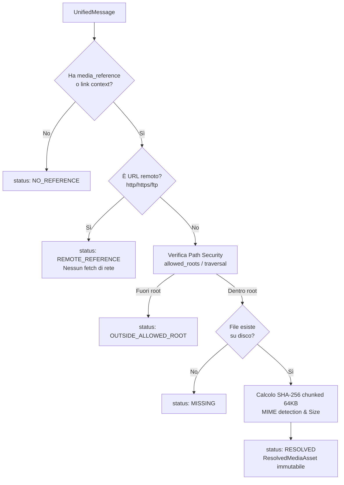
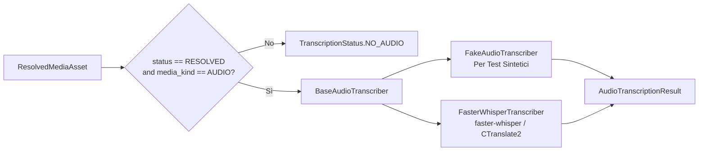

# Multimodal Processing Design Document
## Media Asset Resolution & Local Audio Speech-to-Text (STT)

---

## 1. Ambito e Obiettivi Architetturali

Il presente documento definisce l'architettura tecnica e le specifiche implementative del package `multimodal`, responsabile del primo stadio di elaborazione multimodale della pipeline forense:

$$\text{UnifiedMessage} \longrightarrow \text{MediaResolver} \longrightarrow \text{ResolvedMediaAsset} \longrightarrow \text{AudioTranscriber} \longrightarrow \text{AudioTranscriptionResult}$$

### 1.1 Obiettivi Primari
1. **Media Asset Resolution forense deterministica**:
   - Individuare, verificare e validare su disco i file multimediali referenziati nei messaggi (`UnifiedMessage`) o nei record di dettaglio intra-source (tabella `media_refs` di WhatsApp).
   - Garantire la massima sicurezza contro attacchi di *path traversal* (`../`, symlink non autorizzati, percorsi assoluti arbitrari).
   - Identificare referenze remote (URL HTTP/HTTPS/FTP) marcandole esplicitamente senza effettuare alcuna chiamata di rete non autorizzata.
   - Calcolare l'impronta crittografica SHA-256 in modalità streaming a blocchi (64 KB) senza saturare la memoria volatile.
2. **Audio Processing e Speech-to-Text (STT) locale**:
   - Fornire un'astrazione modulare per la trascrizione audio basata su `BaseAudioTranscriber`.
   - Implementare `FakeAudioTranscriber` per test unitari e di integrazione veloci, deterministici e privi di dipendenze neurali pesanti.
   - Implementare `FasterWhisperTranscriber` basato su `faster-whisper` (CTranslate2) con esecuzione locale su CPU (`compute_type="int8"`), caricamento pigro dei pesi (`lazy loading`) e trascrizione rigorosamente fedele nella lingua originale (`task="transcribe"`).
3. **Integrità e Immutabilità Forense Assoluta**:
   - Il `UnifiedMessage` originale è **completamente immutabile**. Il campo `text_content` non viene **mai** sovrascritto con il testo trascritto.
   - Ogni risultato di trascrizione (`AudioTranscriptionResult`) costituisce un'entità di arricchimento distinta, collegata tramite identificatori forensi (`message_id`, `source_name`, `source_record_id`).
   - Tutte le strutture dati del package (`ResolvedMediaAsset`, `AudioTranscriptSegment`, `AudioTranscriptionResult`) sono rese profondamente immutabili mediante `core.immutability.freeze_structural`.

---

## 2. Modello dei Dati Multimodale (`multimodal.models`)

### 2.1 Enumerazioni Fondamentali

#### `MediaKind`
Tipologia merceologica/astratta del file multimediale:
- `AUDIO`: File audio (vocali, registrazioni, note vocali).
- `IMAGE`: Immagini statiche (JPEG, PNG, WEBP, GIF, TIFF).
- `VIDEO`: Registrazioni video (MP4, 3GP, MKV, AVI, MOV).
- `DOCUMENT`: Documenti e file generici (PDF, DOCX, XLSX, TXT).
- `UNKNOWN`: Tipo non identificabile dall'estensione o MIME type.

#### `MediaResolutionStatus`
Esito deterministico della risoluzione del percorso multimediale:
- `RESOLVED`: Il file esiste fisicamente su disco entro le radici autorizzate, il percorso canonico è verificato, l'hash SHA-256 e la dimensione sono calcolati.
- `NO_REFERENCE`: Il messaggio non contiene alcun riferimento a file multimediali (es. messaggio puramente testuale o privo di allegato).
- `MISSING`: Il messaggio contiene un riferimento a un percorso locale, ma il file non esiste sul filesystem.
- `OUTSIDE_ALLOWED_ROOT`: Il percorso punta a una posizione esterna alle directory consentite (`allowed_roots`) o tenta un *path traversal* malevolo.
- `REMOTE_REFERENCE`: Il percorso è un URL remoto (es. `http://`, `https://`, `ftp://`). Non viene effettuato alcun fetch di rete.
- `AMBIGUOUS`: Percorso ambiguo o collisione non risolvibile.
- `UNSUPPORTED`: Schema di percorso o formato non gestito.

#### `TranscriptionStatus`
Esito dell'elaborazione Speech-to-Text:
- `SUCCESS`: Trascrizione audio completata con successo; testo e segmenti temporali estratti.
- `FAILED`: Errore durante la decodifica audio o l'inferenza del modello neurale (file corrotto, formato non supportato dal decoder, eccezione interna).
- `UNSUPPORTED`: Backend non disponibile o formato non supportato.
- `NO_AUDIO`: Invocazione STT su un asset non audio o non risolto.

### 2.2 Strutture Dati Immutabili

```python
@dataclass(frozen=True)
class ResolvedMediaAsset:
    status: MediaResolutionStatus
    canonical_path: Path | None = None
    relative_path: str | None = None
    media_kind: MediaKind = MediaKind.UNKNOWN
    mime_type: str | None = None
    file_size_bytes: int | None = None
    sha256: str | None = None
    resolution_error: str | None = None
    message_id: str | None = None
    source_name: str | None = None
    source_record_id: str | None = None

@dataclass(frozen=True)
class AudioTranscriptSegment:
    start_seconds: float
    end_seconds: float
    text: str
    confidence: float | None = None

@dataclass(frozen=True)
class AudioTranscriptionResult:
    message_id: str | None
    source_name: str | None
    source_record_id: str | None
    status: TranscriptionStatus
    full_transcript: str
    segments: tuple[AudioTranscriptSegment, ...]
    detected_language: str | None = None
    language_probability: float | None = None
    duration_seconds: float | None = None
    error_message: str | None = None
    engine: str = "unknown"
    model_name: str = "unknown"
    device: str = "cpu"
    compute_type: str = "none"
```

---

## 3. Architettura Media Asset Resolution (`multimodal.resolver`)



### 3.1 Politica di Sicurezza dei Percorsi
- **`allowed_roots` obbligatorie**: La classe `MediaResolver` accetta un insieme esplicito di directory radice autorizzate (`Sequence[Path | str]`). Se non specificato, il default è `(Path.cwd(),)`.
- **Risoluzione canonica (`resolve()`)**: Tutti i percorsi vengono normalizzati tramite `Path.resolve()`, risolvendo qualsiasi occorrenza di `..` o `./` e controllando che il percorso canonico finale inizi con una delle radici autorizzate (`canonical.is_relative_to(root)`).
- **Protezione Symlink**: Se il percorso canonico punta al di fuori della sandbox consentita attraverso un link simbolico o giunzione, viene immediatamente rifiutato con `OUTSIDE_ALLOWED_ROOT`.

### 3.2 Gestione Referenze Remote
- Le stringhe che iniziano con schemi URI noti (`http://`, `https://`, `ftp://`, `ftps://`) vengono catalogate come `MediaResolutionStatus.REMOTE_REFERENCE`.
- **Nessuna connessione esterna**: La pipeline rispetta la regola di non effettuare chiamate di rete, evitando leak di metadati o fetch non autorizzati di file remoti durante l'acquisizione.

### 3.3 Risoluzione Relativa al Contesto di Acquisizione
In contesti di analisi forense, le estrazioni contengono percorsi relativi memorizzati nel database rispetto alla cartella di dump o al percorso del database stesso (es. `WhatsApp Audio/AUD_00001.opus`).
Il resolver tenta la risoluzione:
1. Come percorso assoluto (se già fornito assoluto ed entro `allowed_roots`).
2. Rispetto alla directory genitore del file sorgente (`source_path.parent`), purché all'interno di `allowed_roots`.
3. Rispetto a ciascuna delle `allowed_roots`.

### 3.4 Collegamento Intra-Source per WhatsApp (`MediaResolutionContext`)
Nel database SQLite `msgstore.db`:
- La tabella `messages` contiene 504 record di messaggio (`_id`, `media_url`, ecc.).
- La tabella `media_refs` contiene 115 record con `message_row_id` e `path`.
- L'oggetto `MediaResolutionContext` indicizza in memoria la mappa deterministica `message_row_id -> path`.
- Durante la risoluzione di un `UnifiedMessage` proveniente da `whatsapp_msgstore`, se il messaggio non reca un percorso diretto ma ha un `source_record_id` corrispondente a un `message_row_id` in `media_refs`, il resolver recupera automaticamente il percorso del file.

### 3.5 Calcolo SHA-256 Incrementale (`compute_sha256_chunked`)
- Per evitare il consumo eccessivo di memoria su allegati audio/video di grandi dimensioni, la funzione legge il file in blocchi da 64 KB (`chunk_size=65536`), aggiornando incrementalmente l'oggetto `hashlib.sha256()`.

---

## 4. Architettura Speech-to-Text (`multimodal.transcriber`)



### 4.1 Criteri di Selezione
Solo i record che soddisfano contemporaneamente:
1. `status == MediaResolutionStatus.RESOLVED`
2. `media_kind == MediaKind.AUDIO`
vengono instradati al motore STT. Per qualsiasi altro asset, il resolver/pipeline restituisce un risultato con `status = TranscriptionStatus.NO_AUDIO`.

### 4.2 Astrazione e Backends

#### `BaseAudioTranscriber`
Classe astratta che definisce il contratto formale:
```python
class BaseAudioTranscriber(ABC):
    @abstractmethod
    def transcribe(self, asset: ResolvedMediaAsset) -> AudioTranscriptionResult: ...
    def transcribe_audio(self, asset: ResolvedMediaAsset) -> AudioTranscriptionResult: ...
    @classmethod
    def is_available(cls) -> bool: ...
```

#### `FakeAudioTranscriber`
Backend sintetico deterministico progettato per test unitari e suite CI/CD:
- Non richiede download di modelli neurali né dipendenze binarie C++.
- Restituisce segmenti temporali realistici e confidenze configurabili.
- Permette di simulare scenari di fallimento decodifica (`simulate_failure=True`).

#### `FasterWhisperTranscriber`
Backend reale basato sulla libreria `faster-whisper` (motore CTranslate2):
- **Lazy Loading**: L'istanza di `WhisperModel` non viene creata nel costruttore, ma instanziata al primo utilizzo (`load_model()`), velocizzando l'inizializzazione della pipeline.
- **Configurazione Hardware**:
  - `device="cpu"`
  - `compute_type="int8"` (quantizzazione a 8 bit intero per massima velocità e minimo overhead di RAM su CPU).
  - `cpu_threads=4` (o configurabile).
- **Rigorosa Trascrizione (`task="transcribe"`)**: La trascrizione opera rigorosamente nella lingua nativa parlata nel file audio, preservando l'esatta forma verbale e vietando traduzioni forzate in lingua inglese.
- **Dati Rilevati**: Rilevamento della lingua (`info.language`) e probabilità associata (`info.language_probability`).
- **Segmenti Temporali**: Tutti i segmenti estratti da Whisper vengono mappati in tuple immutabili di `AudioTranscriptSegment(start_seconds, end_seconds, text, confidence)`.
- **Tolleranza ai guasti**: Qualsiasi eccezione durante la decodifica (es. file troncato, formato Opus corrotto) viene intercettata e produce un risultato con `status=TranscriptionStatus.FAILED` ed `error_message`, senza bloccare l'elaborazione dei messaggi successivi.

---

## 5. Pipeline Integrata (`multimodal.pipeline.MultimodalAudioPipeline`)

La classe `MultimodalAudioPipeline` coordina la risoluzione e l'eventuale trascrizione:
```python
class MultimodalAudioPipeline:
    def __init__(self, resolver: MediaResolver, transcriber: BaseAudioTranscriber | None = None) -> None: ...
    def process_message(self, message: UnifiedMessage) -> tuple[ResolvedMediaAsset, AudioTranscriptionResult | None]: ...
    def process_messages(self, messages: Iterable[UnifiedMessage]) -> Iterator[tuple[UnifiedMessage, ResolvedMediaAsset, AudioTranscriptionResult | None]]: ...
```

### 5.1 Garanzia di Immutabilità
Il messaggio `UnifiedMessage` restituito nel generatore è l'istanza originale immutata. Nessun attributo di `UnifiedMessage` viene sovrascritto o alterato. Le trascrizioni sono mantenute come secondo stream di dati correlabile via `message_id`.

---

## 6. Profilazione dei Dati Reali del Repository

L'ispezione diretta dei dati reali presenti in `test_data/` ha evidenziato le seguenti metriche:

| Sorgente | Totale Messaggi | Referenze Media nei Record | Record Trovati Fisicamente su Disco | File Mancanti (`MISSING`) | Note Forensi |
| :--- | :--- | :--- | :--- | :--- | :--- |
| **WhatsApp (`msgstore.db`)** | 504 | 115 (31 Audio, 72 Immagini, 12 Video) | 2 (`IMG_00003.jpg`, `IMG_00012.jpg`) | 113 | 10 file `.opus` sono presenti in `test_data/whatsapp_export/WhatsApp Audio/`, ma corrispondono a numerazioni sintetiche non collegate ai rowid del dump. |
| **Cellebrite CSV** | 302 | 25 (tutte immagini) | 0 | 25 | Puntano a `Files\IMG_0012.jpg` (cartella `Files\` non presente nell'estrazione). |
| **Cellebrite JSON** | 100 | 0 | 0 | 0 | 14 messaggi hanno tipologia dichiarata `audio`, ma `media_path` è `null` $\rightarrow$ correttamente classificati `NO_REFERENCE`. |
| **Cellebrite XML** | 50 | 0 | 0 | 0 | Nessun tag media presente $\rightarrow$ classificati `NO_REFERENCE`. |
| **TOTALE** | **956** | **140** | **2** | **138** | **816 messaggi sono NO_REFERENCE**. |

---

## 7. Roadmap per Fasi Successive (Esclusioni Correnti)

Le seguenti funzionalità **NON** fanno parte della presente fase e sono escluse dall'implementazione corrente:
- **OCR (Optical Character Recognition)**: Estrazione testo da immagini (Tesseract, EasyOCR).
- **Vision / Image Understanding**: Modelli visivi per descrizioni di immagini.
- **LLM / LM Studio / Ollama**: Nessun modello di linguaggio, embedding semantico o clustering tematico.
- **Interfaccia Utente**: Nessuna integrazione Streamlit o web frontend.
