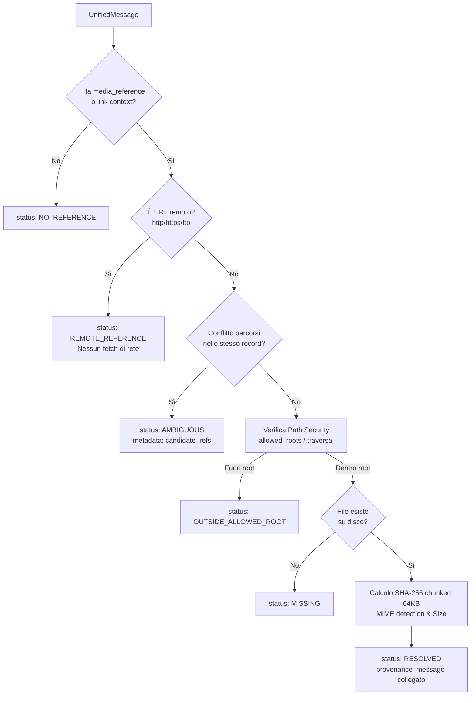
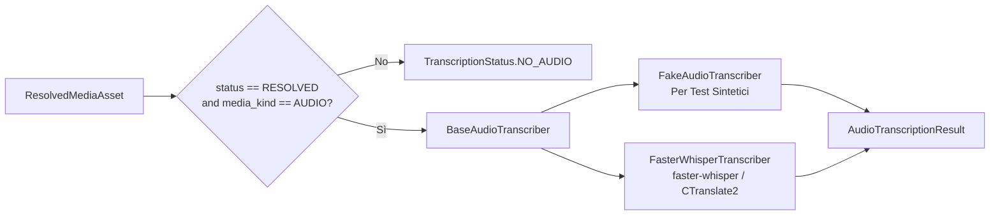
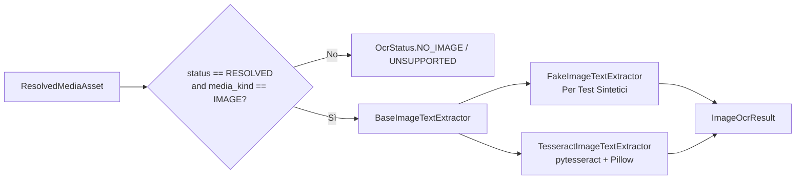
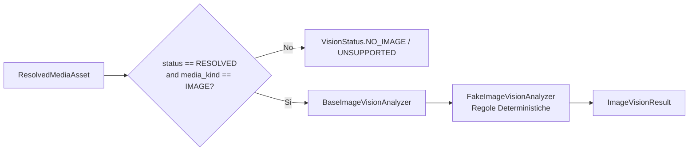
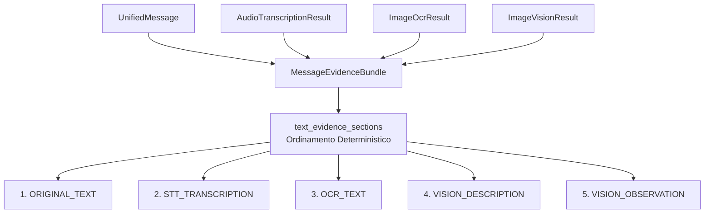

# Multimodal Processing Design Document
## Media Asset Resolution, Local Audio Speech-to-Text (STT), Image OCR, Image Vision Foundation & Multimodal Evidence Bundle

---

## 1. Ambito e Obiettivi Architetturali

Il presente documento definisce l'architettura tecnica e le specifiche implementative del package `multimodal`, responsabile dell'elaborazione multimodale della pipeline forense:

$$\text{UnifiedMessage} \longrightarrow \text{MediaResolver} \longrightarrow \text{ResolvedMediaAsset} \longrightarrow \begin{cases} \text{AudioTranscriber} \longrightarrow \text{AudioTranscriptionResult} \\ \text{ImageTextExtractor} \longrightarrow \text{ImageOcrResult} \\ \text{ImageVisionAnalyzer} \longrightarrow \text{ImageVisionResult} \end{cases}$$

Tutti i risultati di estrazione ed evidenza confluiscono nel contenitore aggregato:
$$\text{MessageEvidenceBundle}(\text{message}, \text{audio\_transcription}, \text{image\_ocr}, \text{image\_vision})$$

### 1.1 Obiettivi Primari
1. **Media Asset Resolution forense deterministica**:
   - Individuare, verificare e validare su disco i file multimediali referenziati nei messaggi (`UnifiedMessage`) o nei record di dettaglio intra-source (tabella `media_refs` di WhatsApp).
   - Garantire la massima sicurezza contro attacchi di *path traversal* (`../`, symlink non autorizzati, percorsi assoluti arbitrari).
   - Identificare referenze remote (URL HTTP/HTTPS/FTP) marcandole esplicitamente senza effettuare alcuna chiamata di rete non autorizzata.
   - Calcolare l'impronta crittografica SHA-256 in modalità streaming a blocchi (64 KB) senza saturare la memoria volatile.
   - Risolvere ambiguità o percorsi multipli senza silent overwrite (`MediaResolutionContext`), marcando lo status come `AMBIGUOUS`.
2. **Audio Processing e Speech-to-Text (STT) locale**:
   - Fornire un'astrazione modulare per la trascrizione audio basata su `BaseAudioTranscriber`.
   - Implementare `FakeAudioTranscriber` per test unitari e di integrazione veloci, deterministici e privi di dipendenze neurali pesanti.
   - Implementare `FasterWhisperTranscriber` basato su `faster-whisper` (CTranslate2) con esecuzione locale su CPU (`compute_type="int8"`), caricamento pigro dei pesi (`lazy loading`) e trascrizione rigorosamente fedele nella lingua originale (`task="transcribe"`).
3. **Image Processing e Optical Character Recognition (OCR) locale**:
   - Fornire un'astrazione modulare per l'estrazione ottica del testo basata su `BaseImageTextExtractor`.
   - Implementare `FakeImageTextExtractor` per test unitari offline privi di dipendenze binarie.
   - Implementare `TesseractImageTextExtractor` basato su `pytesseract` e Pillow, con protezione locale da decompression bomb, tolleranza totale a file corrotti/troncati (JPEG stubs) e gestione graceful dell'assenza del binario Tesseract sull'host.
4. **Image Vision Foundation**:
   - Fornire un'astrazione modulare per l'analisi visiva delle immagini basata su `BaseImageVisionAnalyzer`.
   - Implementare `FakeImageVisionAnalyzer` deterministico per test offline.
   - Definire vincoli etici e forensi invalicabili: **nessun riconoscimento facciale, nessuna inferenza di identità, nessun biometric profiling**, limitando l'analisi a descrizioni oggettive di scena, oggetti e testo visibile.
5. **Multimodal Evidence Bundle**:
   - Fornire una struttura aggregata `MessageEvidenceBundle` che unisce il messaggio unificato e tutte le evidenze estratte (STT, OCR, Vision) con ordinamento deterministico delle sezioni testuali (`TextEvidenceSection`).
   - Preservare integralmente il testo originario e le lingue originali senza traduzioni forzate.
   - **Nessuna sovrascrittura**: `UnifiedMessage.text_content` non viene mai contaminato con le evidenze estratte.
   - Nessun embedding vettoriale o modello generativo in questa fase.
6. **Integrità e Immutabilità Forense Assoluta**:
   - Il `UnifiedMessage` originale è **completamente immutabile**.
   - Ogni risultato di trascrizione (`AudioTranscriptionResult`), OCR (`ImageOcrResult`), visione (`ImageVisionResult`) ed evidenza aggregata (`MessageEvidenceBundle`) costituisce un'entità distinta, collegata tramite identificatori forensi (`message_id`, `source_name`, `source_record_id`, `provenance_asset`).
   - Piena catena di provenance: `Result.provenance_asset -> ResolvedMediaAsset.provenance_message -> UnifiedMessage`.
   - Tutte le strutture dati del package sono rese profondamente immutabili mediante `core.immutability.freeze_structural`.

---

## 2. Modello dei Dati Multimodale (`multimodal.models`)

### 2.1 Enumerazioni Fondamentali

#### `MediaKind`
Tipologia merceologica/astratta del file multimediale:
- `AUDIO`: File audio (vocali, registrazioni, note vocali).
- `IMAGE`: Immagini statiche (JPEG, PNG, WEBP, GIF, TIFF).
- `VIDEO`: Registrazioni video (MP4, 3GP, MKV, AVI, MOV).
- `DOCUMENT`: Documenti e file generici (PDF, DOCX, XLSX, TXT).
- `UNKNOWN`: Tipo non identificabile dall'estensione o MIME type.

#### `MediaResolutionStatus`
Esito deterministico della risoluzione del percorso multimediale:
- `RESOLVED`: Il file esiste fisicamente su disco entro le radici autorizzate, il percorso canonico è verificato, l'hash SHA-256 e la dimensione sono calcolati.
- `NO_REFERENCE`: Il messaggio non contiene alcun riferimento a file multimediali (es. messaggio puramente testuale o privo di allegato).
- `MISSING`: Il messaggio contiene un riferimento a un percorso locale, ma il file non esiste sul filesystem.
- `OUTSIDE_ALLOWED_ROOT`: Il percorso punta a una posizione esterna alle directory consentite (`allowed_roots`) o tenta un *path traversal* malevolo.
- `REMOTE_REFERENCE`: Il percorso è un URL remoto (es. `http://`, `https://`, `ftp://`). Non viene effettuato alcun fetch di rete.
- `AMBIGUOUS`: Percorso ambiguo o collisione non risolvibile (es. percorsi multipli contrastanti per lo stesso record).
- `UNSUPPORTED`: Schema di percorso o formato non gestito.

#### `TranscriptionStatus`
Esito dell'elaborazione Speech-to-Text:
- `SUCCESS`: Trascrizione audio completata con successo; testo e segmenti temporali estratti.
- `FAILED`: Errore durante la decodifica audio o l'inferenza del modello neurale (file corrotto, formato non supportato dal decoder, eccezione interna).
- `UNSUPPORTED`: Backend non disponibile o formato non supportato (richiesto AUDIO).
- `NO_AUDIO`: Invocazione STT su un asset privo di audio o non risolto.

#### `OcrStatus`
Esito dell'elaborazione Optical Character Recognition:
- `SUCCESS`: Estrazione completata con successo e testo rilevato nell'immagine.
- `NO_TEXT`: Elaborazione completata senza errori, ma nessun testo rilevato nell'immagine (immagine vuota o priva di scritte).
- `FAILED`: Errore durante la decodifica dell'immagine o l'esecuzione del motore OCR (file troncato, file a 0 byte, timeout).
- `NO_IMAGE`: Asset privo di file immagine o non risolto sul filesystem.
- `UNSUPPORTED`: Asset non supportato o tipo di media non compatibile (richiesto IMAGE).

#### `VisionStatus`
Esito dell'elaborazione Image Vision:
- `SUCCESS`: Analisi visiva completata con successo; descrizione e osservazioni generate.
- `NO_CONTENT`: Immagine priva di contenuto visivo rilevabile o non informativa.
- `FAILED`: Errore durante l'elaborazione dell'immagine o l'analisi visiva.
- `NO_IMAGE`: Asset privo di file immagine o non risolto sul filesystem.
- `UNSUPPORTED`: Asset non supportato o tipo di media non compatibile (richiesto IMAGE).

### 2.2 Strutture Dati Immutabili

```python
@dataclass(frozen=True)
class ResolvedMediaAsset:
    message_id: str
    source_name: str
    source_record_id: str
    raw_reference: str | None
    resolved_path: str | None
    media_kind: MediaKind
    status: MediaResolutionStatus
    file_size_bytes: int | None = None
    sha256: str | None = None
    provenance_message: UnifiedMessage | None = None
    metadata: Mapping[str, Any] = field(default_factory=dict)

@dataclass(frozen=True)
class AudioTranscriptSegment:
    start_seconds: float
    end_seconds: float
    text: str

@dataclass(frozen=True)
class AudioTranscriptionResult:
    message_id: str
    source_name: str
    source_record_id: str
    status: TranscriptionStatus
    full_transcript: str = ""
    segments: tuple[AudioTranscriptSegment, ...] = ()
    detected_language: str | None = None
    language_probability: float | None = None
    engine: str = "faster-whisper"
    model_name: str = "tiny"
    device: str = "cpu"
    compute_type: str = "int8"
    provenance_asset: ResolvedMediaAsset | None = None
    error_message: str | None = None
    metadata: Mapping[str, Any] = field(default_factory=dict)

    @property
    def asset_sha256(self) -> str | None:
        return self.provenance_asset.sha256 if self.provenance_asset is not None else None

@dataclass(frozen=True)
class OcrTextRegion:
    text: str
    bounding_box: tuple[int, int, int, int] | None = None  # (left, top, width, height)
    confidence: float | None = None  # normalizzato [0.0, 1.0]
    order_index: int = 0

@dataclass(frozen=True)
class ImageOcrResult:
    message_id: str
    source_name: str
    source_record_id: str
    status: OcrStatus
    full_text: str = ""
    regions: tuple[OcrTextRegion, ...] = ()
    language_config: str | None = None  # Configurazione linguistica passata a OCR (es. "ita+eng")
    engine: str = "tesseract"
    engine_version: str | None = None
    provenance_asset: ResolvedMediaAsset | None = None
    error_message: str | None = None
    metadata: Mapping[str, Any] = field(default_factory=dict)

    @property
    def asset_sha256(self) -> str | None:
        return self.provenance_asset.sha256 if self.provenance_asset is not None else None

@dataclass(frozen=True)
class ImageVisionResult:
    message_id: str
    source_name: str
    source_record_id: str
    status: VisionStatus
    description: str = ""
    observations: tuple[str, ...] = ()
    engine: str = "fake-vision"
    model_name: str = "deterministic-rules"
    provenance_asset: ResolvedMediaAsset | None = None
    error_message: str | None = None
    metadata: Mapping[str, Any] = field(default_factory=dict)

    @property
    def asset_sha256(self) -> str | None:
        return self.provenance_asset.sha256 if self.provenance_asset is not None else None
```

---

## 3. Architettura Media Asset Resolution (`multimodal.resolver`)



### 3.1 Politica di Sicurezza dei Percorsi
- **`allowed_roots` obbligatorie**: La classe `MediaResolver.__init__` richiede esplicitamente una sequenza non vuota di directory radice autorizzate (`Sequence[Path | str]`). Non esiste un valore predefinito implicito (come `Path.cwd()`); se la sequenza è vuota, viene sollevato un `ValueError`.
- **Risoluzione canonica (`resolve()`)**: Tutti i percorsi vengono normalizzati tramite `Path.resolve()`, risolvendo qualsiasi occorrenza di `..` o `./` e controllando che il percorso canonico finale inizi con una delle radici autorizzate (`canonical.is_relative_to(root)`).
- **Protezione Symlink**: Se il percorso canonico punta al di fuori della sandbox consentita attraverso un link simbolico o giunzione, viene immediatamente rifiutato con `OUTSIDE_ALLOWED_ROOT`.

### 3.2 Gestione Referenze Remote
- Le stringhe che iniziano con schemi URI noti (`http://`, `https://`, `ftp://`, `ftps://`) vengono catalogate come `MediaResolutionStatus.REMOTE_REFERENCE`.
- **Nessuna connessione esterna**: La pipeline rispetta la regola di non effettuare chiamate di rete, evitando leak di metadati o fetch non autorizzati di file remoti durante l'acquisizione.

### 3.3 Collegamento Intra-Source per WhatsApp (`MediaResolutionContext`)
Nel database SQLite `msgstore.db`:
- La tabella `messages` contiene 504 record di messaggio (`_id`, `media_url`, ecc.).
- La tabella `media_refs` contiene 115 record con `message_row_id` e `path`.
- L'oggetto `MediaResolutionContext` preserva **tutti** i riferimenti per `message_row_id` come liste ordinate.
- **Politica di Ambiguità basata su uguaglianza esatta di stringhe**: `is_ambiguous(message_row_id)` confronta le rappresentazioni testuali esatte dei percorsi registrati. Se per lo stesso ID compaiono stringhe di percorso distinte, viene rilevata un'ambiguità e il resolver marca lo status come `AMBIGUOUS` registrando tutti i candidati nei metadati (`candidate_media_refs`) senza sovrascritture silenti. Percorsi identici come stringa non costituiscono ambiguità.

---

## 4. Architettura Speech-to-Text (`multimodal.transcriber`)



### 4.1 Caratteristiche del Motore STT
- **Lazy Loading**: Istanziazione ritardata del modello Whisper al primo utilizzo.
- **Configurazione CPU**: `device="cpu"`, `compute_type="int8"`.
- **Task**: Rigorosamente `task="transcribe"`, nessuna traduzione.
- **Error Handling**: Distinzione tra errore globale (`AudioBackendUnavailableError`, `AudioModelLoadError`) ed errore per-file (`TranscriptionStatus.FAILED`).

---

## 5. Architettura Image OCR (`multimodal.ocr`)



### 5.1 Caratteristiche del Motore OCR
1. **Astrazione `BaseImageTextExtractor`**: Contratto unificato per motori OCR intercambiabili.
2. **`FakeImageTextExtractor`**: Simulatore deterministico offline per test veloci con supporto a `canned_regions`, `simulate_failure` e `simulate_no_text`.
3. **`TesseractImageTextExtractor`**:
   - Verifica dinamica della presenza del binario tramite `is_available()`. Gestione rigorosa delle eccezioni: intercetta solo `(OSError, subprocess.SubprocessError, pytesseract.TesseractNotFoundError, pytesseract.TesseractError)`, lasciando propagare errori di programmazione o bug non gestiti.
   - Se il binario non è presente nel PATH né configurato via `tesseract_cmd`, solleva `OcrBackendUnavailableError` senza hardcoding di percorsi Windows/Linux.
   - Decodifica sicura con Pillow: protezione locale da decompression bomb calcolata su `(img.width * img.height) > MAX_PIXELS` (senza alterare la variabile globale `Image.MAX_IMAGE_PIXELS`), con forzatura caricamento pixel (`img.load()`) per intercettare file troncati.
   - Parsing granulare dell'output `image_to_data`: estrazione di `bounding_box` (x, y, w, h), normalizzazione confidenza in [0.0, 1.0], assegnazione di `order_index`.
   - Distinzione semantica: se l'immagine non contiene parole, restituisce `OcrStatus.NO_TEXT`; se fallisce la decodifica restituisce `OcrStatus.FAILED`.
   - Parametro `language_config`: tracciamento esplicito della configurazione linguistica utilizzata (es. `ita+eng`), distinguendola chiaramente da un'ipotetica lingua rilevata dall'algoritmo.

---

## 6. Architettura Image Vision Foundation (`multimodal.vision`)



### 6.1 Principi Fondamentali e Confini Etici Forensi
1. **Astrazione `BaseImageVisionAnalyzer`**: Interfaccia contrattuale con metodi `analyze()` e `is_available()`.
2. **`FakeImageVisionAnalyzer`**: Implementazione euristica deterministica per test offline, senza dipendenze da modelli pesanti.
3. **Pipeline di Coordinamento (`MultimodalVisionPipeline`)**: Riceve `UnifiedMessage`, risolve l'asset immagine tramite `MediaResolver`, ed esegue l'analisi visiva solo se l'asset è `RESOLVED` e `media_kind == IMAGE`.
4. **Vincoli Etici e Forensi Assoluti**:
   - **Nessun Riconoscimento Facciale**: L'analizzatore non esegue facial recognition o face matching.
   - **Nessuna Inferenza di Identità**: Nessuna associazione tra volti/persone e identità specifiche.
   - **Nessun Profiling Biometrico**: Nessuna stima di razza, genere, orientamento, stato emotivo o attributi protetti.
   - L'analisi visiva deve limitarsi a descrizioni oggettive di scena, oggetti inanimati, contesti ambientali e testo leggibile.
5. **Nessun Modello Neurale Vision in questa Fase**: L'architettura stabilisce l'astrazione e i contratti, lasciando l'integrazione di veri modelli neurali visivi a fasi future espressamente autorizzate.

---

## 7. Multimodal Evidence Bundle (`multimodal.evidence`)

Il modulo `multimodal.evidence` realizza l'aggregazione unificata delle evidenze estratte da un messaggio e dai suoi allegati multimediali.



### 7.1 Componenti del Bundle
- **`EvidenceSourceType`**: Enumerazione delle sorgenti testuali con ordinamento deterministico:
  1. `ORIGINAL_TEXT`: Testo originale del messaggio (`UnifiedMessage.text_content`).
  2. `STT_TRANSCRIPTION`: Trascrizione audio generata da STT (`AudioTranscriptionResult.full_transcript`).
  3. `OCR_TEXT`: Testo estratto tramite OCR (`ImageOcrResult.full_text`).
  4. `VISION_DESCRIPTION`: Descrizione oggettiva generata dall'analisi visiva (`ImageVisionResult.description`).
  5. `VISION_OBSERVATION`: Singola osservazione oggettiva da analisi visiva (`ImageVisionResult.observations[i]`).
- **`TextEvidenceSection`**: Dataclass immutabile rappresentante una singola sezione informativa con tracciamento forense granulare:
  - `evidence_id: str`: Identificatore deterministico univoco calcolato nella forma:
    - `<message_id>::ORIGINAL_TEXT`
    - `<message_id>::STT_TRANSCRIPTION`
    - `<message_id>::OCR_TEXT`
    - `<message_id>::VISION_DESCRIPTION`
    - `<message_id>::VISION_OBSERVATION::<ordinal>`
  - `source_type: EvidenceSourceType`: Tipologia della sorgente da cui origina il testo.
  - `text: str`: Contenuto testuale originario dell'evidenza (non alterato, preservato byte per byte).
  - `language: str | None`: Lingua rilevata dal motore (es. da Whisper) o configurata (es. Tesseract), oppure `None`.
  - `message_id: str`: Identificativo unificato del messaggio genitore.
  - `source_name: str`: Sorgente forense d'origine (es. `msgstore_db`, `cellebrite_csv`).
  - `source_record_id: str`: Identificativo primario del record d'origine.
  - `ordinal: int`: Indice sequenziale deterministico dell'evidenza all'interno del bundle (a partire da 0).
- **`MessageEvidenceBundle`**: Struttura aggregata che raccoglie:
  - `message: UnifiedMessage` (obbligatorio, immutato);
  - `audio_transcription: AudioTranscriptionResult | None`;
  - `image_ocr: ImageOcrResult | None`;
  - `image_vision: ImageVisionResult | None`;
  - `property text_evidence_sections`: Genera la lista immutabile delle sezioni testuali presenti, rigorosamente ordinate per `EvidenceSourceType` e ordinal.
  - Invarianti di validazione in `__post_init__`: Se presenti evidenze, i loro `message_id`, `source_name` e `source_record_id` devono coincidere simultaneamente con quelli del messaggio unificato. Per i risultati con esito `SUCCESS`, è obbligatoria l'intera catena di provenance (`provenance_asset` e `provenance_asset.provenance_message`).

### 7.2 Regole di Integrità e Multilinguismo
- **Nessuna Sovrascrittura o Concatenazione forzata**: `UnifiedMessage.text_content` non viene alterato. Le sezioni rimangono distinte e separate, ciascuna con metadati di tracciamento.
- **Preservazione Multilingue**: Tutte le trascrizioni e i testi estratti preservano la lingua originale del supporto (nessuna traduzione automatica).
- **Nessun Embedding Vettoriale**: La struttura non include vettori, embedding o indici di similarità, riservati a fasi successive.

---

## 8. Profilazione Dati Reali (`test_data/`)

| Sorgente | Totale Messaggi | Referenze Media nei Record | Record Trovati Fisicamente su Disco | File Mancanti (`MISSING`) | Note Forensi |
| :--- | :--- | :--- | :--- | :--- | :--- |
| **WhatsApp (`msgstore.db`)** | 504 | 115 (31 Audio, 72 Immagini, 12 Video) | 2 (`IMG_00003.jpg`, `IMG_00012.jpg`) | 113 | I file immagine su disco sono 20 stub JFIF (19 da 220 byte troncati, 1 a 0 byte). Nessun audio reale presente. |
| **Cellebrite CSV** | 302 | 25 (tutte immagini) | 0 | 25 | Cartella `Files\` assente nell'estrazione. |
| **Cellebrite JSON** | 100 | 0 | 0 | 0 | `media_path` è sempre `null` $\rightarrow$ `NO_REFERENCE`. |
| **Cellebrite XML** | 50 | 0 | 0 | 0 | Nessun tag media $\rightarrow$ `NO_REFERENCE`. |
| **TOTALE** | **956** | **140** | **2** | **138** | **816 messaggi sono NO_REFERENCE**. |

---

## 9. Roadmap per Fasi Successive (Esclusioni Correnti)

Le seguenti funzionalità **NON** fanno parte della presente fase e sono tassativamente escluse dall'implementazione corrente:
- **Vision LLM / Multimodal AI**: Modelli visivi multimodali reali (Llama-Vision, Qwen-VL, DeepSeek-VL).
- **LLM / LM Studio / Ollama**: Nessun modello di linguaggio, embedding semantico, ricerca vettoriale o clustering tematico.
- **Interfaccia Utente**: Nessuna integrazione Streamlit o web frontend.
- **Video Analysis**: Nessun estrattore di frame o trascrizione video automatizzata.
- **Traduzione Automatica**: Nessun modulo di traduzione; STT, OCR e Vision preservano rigorosamente il testo e le descrizioni fedeli ai dati.
